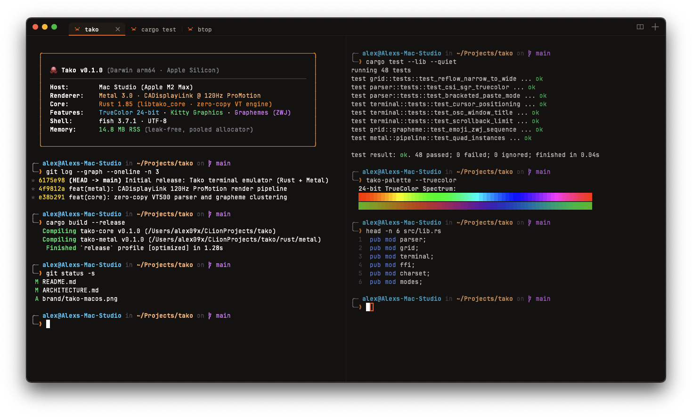

# Tako 🐙

A fast, lightweight, and modern GPU-accelerated terminal for macOS 14+ and iOS 17+, powered by a pure-Rust emulation engine and a native Metal renderer.

[](https://apple.com/macos)
[](https://apple.com/ios)
[](https://rust-lang.org)
[](https://developer.apple.com/metal/)
[](LICENSE)

<p align="center">
  
</p>

---

## Highlights

- **Pure-Rust Engine (`tako_core`)**:
  - Full VT100, xterm, and modern terminal sequence support.
  - Kitty Keyboard Protocol (progressive enhancements, disambiguation, event queries).
  - Kitty Graphics Protocol (direct and chunked image transmission/rendering).
  - Asynchronous PTY execution with non-blocking multi-threaded pipeline.
  - Embedded SSH client support (`features = ["ssh"]`).

- **Hardware-Accelerated Metal Renderer (`TakoCoreUI`)**:
  - GPU rendering with Metal vertex and fragment shaders (`TerminalShaders.metal`).
  - Sub-cell smooth scrolling at 60/120 Hz synchronized with `CADisplayLink`.
  - Row-level damage tracking (`memcmp` over packed cells), so an idle or
    mostly static screen does no redundant GPU work.
  - CoreText font shaping with fallback to system fonts and Nerd Font symbols.

- **Native macOS Experience**:
  - Native tabs, split panes (horizontal & vertical), Quick Terminal dropdown.
  - Native AppleScript dictionary (`Tako.sdef`).
  - Window transparency and customizable titlebar styling.

- **Cross-Platform Swift Component**:
  - Shared view layer: `TakoTerminalNSView` for macOS (AppKit) and `TakoTerminalView` for iOS (UIKit).

---

## Quick Start: Building the macOS App

### Prerequisites

- macOS 14.0 or later on Apple Silicon
- [Rust toolchain](https://rustup.rs) (`rustup default stable`)
- Xcode 15+ and Command Line Tools (`xcode-select --install`)
- Python 3.10+

### Build & Run

```bash
# 1. Clone the repository
git clone https://github.com/alex09x/tako.git
cd tako

# 2. Build the macOS application bundle (target/macapp/Tako.app)
python3 scripts/build-macapp.py

# 3. Run automated headless verification (keys, shell input, smooth scroll)
./scripts/selftest-macapp.sh

# 4. Install to /Applications/Tako.app
./scripts/install-macapp.sh
```

You can now launch Tako from Spotlight, Launchpad, or the terminal:
```bash
open -a Tako
```

---

## Automated Self-Tests

Tako ships with an end-to-end integration test runner that exercises real macOS events, PTY streams, and Metal presentation callbacks:

```bash
# Run the macOS app self-test suite
./scripts/selftest-macapp.sh
```

```text
== keys: an NSEvent must produce the bytes it stands for ==
a          chars=a -> 61 (a)
shift+a    chars=A -> 41 (A)
ctrl+c     chars=  -> 03 ( )
ctrl+c cyr chars=с -> 03 ( )

== input: typing must reach the real shell and come back on screen ==
expected the last line to contain: hello world (space test)
╰ ❯ hello world

== scroll: a precise delta must move the grid by a fraction of a row ==
ok    after 1 of 3 points up             presented=0.3333 expected=0.3333
ok    after 2 of 3 points up             presented=0.6667 expected=0.6667
ok    after 3 of 3 points up             presented=1.0000 expected=1.0000

frames submitted=12 presented=10
macapp self-test: ok
```

To run the Rust engine test suite:
```bash
cargo test
```

The Swift suites need the engine built locally first:
```bash
./scripts/build-xcframework.sh
./scripts/swift-test.sh
```

---

## Configuration

Tako reads its configuration from `~/.config/tako/config`. 

Press <kbd>Cmd</kbd> + <kbd>,</kbd> inside Tako to automatically create and open this file in your default editor.

### Example `~/.config/tako/config`

```ini
# Theme & Appearance
theme = TokyoNight
font-family = JetBrains Mono
font-size = 13.5
background-opacity = 0.95
background-blur-radius = 20

# Window layout
window-padding-x = 8
window-padding-y = 8
macos-titlebar-style = transparent

# Keybindings
keybind = super+t=new_tab
keybind = super+d=new_split:right
keybind = super+shift+d=new_split:down
keybind = super+w=close_surface
```

---

## Swift Package Integration

Tako can be embedded in any macOS or iOS application as a Swift Package:

```swift
import TakoCoreUI

// Create terminal surface
let terminal = TakoTerminalNSView(frame: view.bounds)
terminal.delegate = self
view.addSubview(terminal)

// Send data received from PTY or SSH
terminal.feed(data: incomingBytes)
```

Implement `TakoTerminalNSViewDelegate` to forward user input and resize events back to your backend transport.

---

## Architecture

For an in-depth breakdown of the internal layers, UniFFI bridging, PTY pipeline, and GPU rendering architecture, see [ARCHITECTURE.md](ARCHITECTURE.md).

---

## License & Attribution

Tako is licensed under the [MIT License](LICENSE).

- The bundled JetBrains Mono Nerd Font is under the SIL Open Font License 1.1 ([`swift/Resources/fonts/OFL.txt`](swift/Resources/fonts/OFL.txt)).
- Reference test fixtures adapted from [Alacritty](https://github.com/alacritty/alacritty) (Apache 2.0 License, © The Alacritty Project).
- Full third-party notices and licenses are documented in [NOTICE.md](NOTICE.md).
